# 姿态解算

## 1. 背景
姿态解算是飞控的一个基础、重要部分，估计出来的姿态会发布给姿态控制器，控制飞行平稳，是飞行稳定的最重要保障。另外，姿态解算不仅仅用于无人机领域，无人车领域也需要进行姿态解算，用以进行GNSS和IMU、激光点云的融合定位。

------------------------------------------------------------

## 2. 主要内容
* 传感器基本原理
* 坐标系描述
* 姿态的几种表示方式
* 姿态解算的基本算法

------------------------------------------------------------
  
### 3. 传感器基本原理
> 不展开，推荐以下参考：
> *  [AHRS姿态解算说明(加速度+陀螺仪+磁力计原理及原始数据分析)](http://www.51hei.com/bbs/dpj-92911-1.html)
> * [IMU&GPS融合定位：：加速度计基本原理](https://blog.csdn.net/dieju8330/article/details/102653318)
> ……

------------------------------------------------------------

### 4. 坐标系描述
运载体在三位空间中运动包含六个自由度，既有角运动又有线运动。在地球表面附近，运载体的角运动又有线运动。运载体上的惯性传感器（imu）是相对于惯性空间进行测量的，另外，地球绕其自转轴相对于惯性空间以常值角速度旋转，运载体在地球表面上的位置变化会引起其相对于地心的角速度变化。

#### 4.1 地心惯性坐标系(i系,inertial frame)
地心惯性坐标系用o<sub>i</sub>x<sub>i</sub>y<sub>i</sub>z<sub>i</sub>表示，原点为地球中心，x轴指向春分点（赤道面与黄道面的交线再与天球相交的交点之一），春分点是天文测量中确定恒星时的起点，z轴为地球自转轴，指向北极，**惯性传感器**的输出就是基于该坐标系为参考坐标系的。

#### 4.2 地球坐标系(e系,earth frame)
地球坐标系用o<sub>e</sub>x<sub>e</sub>y<sub>e</sub>z<sub>e</sub>表示，x轴指向本初子午线与赤道面的交点，z轴为地球自转轴，指向北极。e系与地球固连，也称 **地心地固坐标系 （Earth-Centered Earth-Fixed,ECEF)**,地球坐标系相对于惯性坐标系的角速度大小为地球自传角速度，
$$w_{ie}=7.2921151467*10^{-5} rad/s$$

#### 4.3 地理坐标系(g系,geographic frame)
WGS-84

#### 4.4 当地导航坐标系(e系,earth frame)
导航坐标系用o<sub>e</sub>x<sub>e</sub>y<sub>e</sub>z<sub>e</sub>，它是惯性导航系统在求解导航参数时采用的参考坐标系。纯惯导系统的高度通道在原理上是发散的，因而惯导系统多采用当地水平坐标系作为参考坐标系，以实现水平和高度通道的解偶，即利用惯导长时间导航定位时只进行水平定位结算，简单地将高度值设为固定。
常用的导航坐标系为东-北-天（ENU）导航坐标系
* X轴：指东
* Y轴：指北
* Z轴：指天
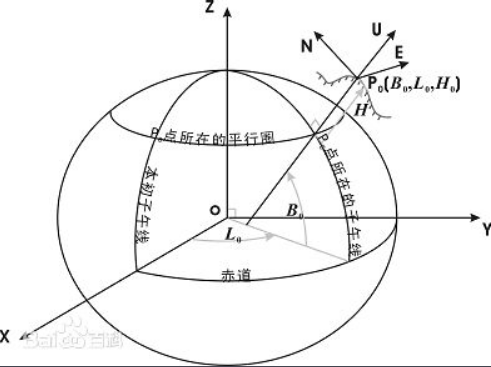

#### 4.5 载体坐标系(b系,body frame)
载体坐标系用o<sub>b</sub>x<sub>b</sub>y<sub>b</sub>z<sub>b</sub>表示，原点为载体重心，右-前-上坐标系描述：x轴沿载体横轴向右，y轴沿载体纵轴向前（即载体前进方向），z轴沿载体立轴向上。b系与载体固连，载体坐标系b系与导航坐标系n系的关系可用一组欧拉角表示。


#### 4.6 常用相连坐标系(特指载体坐标系和导航坐标系))

##### 4.6.1 东北天(ENU)——右前上

**(1)东北天——当地导航坐标系**
* X轴：指东;
* Y轴：指北;
* Z轴：指天。
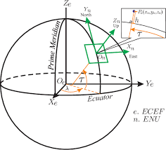
画成平面，如下图：
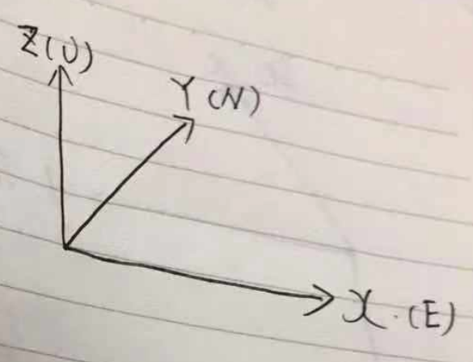

**(2)右前上——当地导航坐标系**
* X轴：指向载体右侧;
* Y轴：指向载体前进方向;
* Z轴：指天。
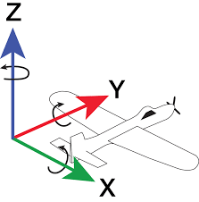
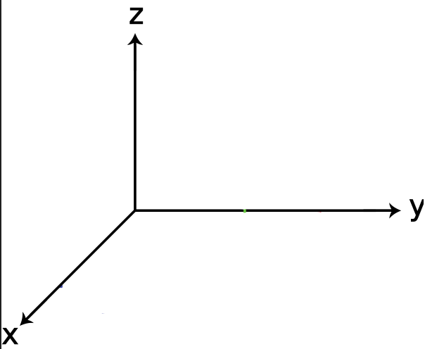

------------------------------------------------------------

### 5. 姿态的描述
#### 5.1 欧拉角
> 欧拉角用来直观表示载体的姿态，如下图
> 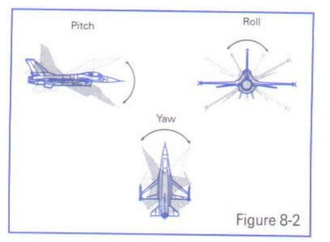
> * 偏航角Yaw $ (\psi)  [-180\degree,+180\degree]$
> 
> * 俯仰角Pitch $ (\theta)[-90\degree,+90\degree] $
> 
> * 翻滚角Roll $(\phi)  [-180\degree,+180\degree] $
> 
* **Proper Euler angles** (z-x-z, x-y-x, y-z-y, z-y-z, x-z-x, y-x-y)
  指第一次旋转和第三次旋转中使用相同的轴（313），比较少用
* **泰特-布莱恩角**
    泰特布莱恩角表示围绕三个不同轴的旋转，如Z-X\'-Y\''

**上图描述了一组欧拉角，主要看右图就好了**
* (1)原坐标系1如蓝色的x-y-z
* (2)坐标系1沿z轴，逆时针旋转$\psi (\psi >0)$，认为沿z轴逆时针旋转为正方向，$\psi=Yaw$；然后得到了黄色的坐标系2x'-y'-z'
* (3)将坐标系2沿x(N)轴逆时针旋转$\theta(\theta >0)$，得到了红色的坐标系N-Y-Z 
* (4)将红色坐标系沿Y轴顺时针旋转$(\phi)$，得到了目的坐标系:红色的X-Y-Z坐标系

#### 5.2 旋转矩阵（方向余弦矩阵)
> 由于使用欧拉角描述姿态存在万向节死锁的问题，具体参见：[万向节死锁 gimbal lock](https://www.cnblogs.com/timeObjserver/p/5936258.html)
> 因此引入方向余弦矩阵
#### 5.2.1 方向余弦矩阵的基本形式
一个向量的方向（姿态）我们可以用他在参考坐标系（地理坐标系）各个轴向的夹角的余弦来表示（及在各个轴的投影）。
类似的 一个坐标系 可以看成是3个向量组成，所以三个向量分别在坐标轴上的投影可以用来表示一个坐标系与参考坐标系的关系。这总共9个方向余弦组成了一个三阶矩阵，其对应方式如下图。
$$
\quad
    C_b^n=
    \begin{bmatrix} c_{11} & c_{12} &c_{13} \\ 
                    c_{21} & c_{22} &c_{23} \\
                    c_{11} & c_{12} &c_{13}
    \end{bmatrix}
\quad
$$
其中，第 i 行、 j 列的元素表示参考坐标系 i 轴和姿态坐标系 j 轴夹角的余弦。事实上方向余弦和欧拉角没有本质区别，因为方向余弦实际上就是用欧拉角表示的。

#### 5.2.2 方向余弦矩阵的举例推导
一个二维的坐标变换如下：
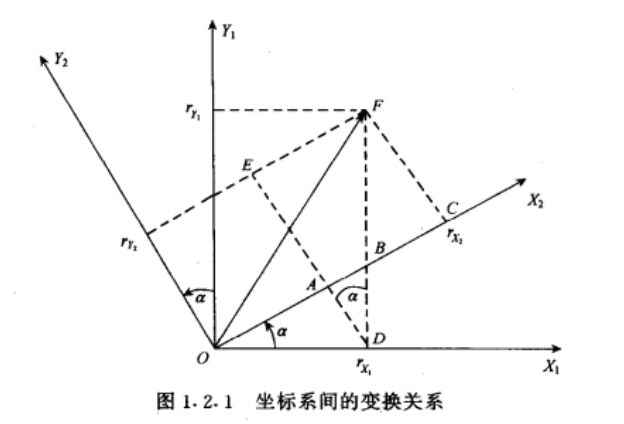
点F为固定点，在坐标系1下的表示为$F(r_{x1},r_{y1})$，在坐标系2下为$F_{2}(r_{x2},r_{y2})$
由图可知
$$
\begin{aligned}
    r_{x2}&=r_{x1}*\cos \alpha+ r_{y1}*\sin \alpha \\
    r_{y2}&=r_{x1}*(-\sin \alpha)+r_{y1}*\cos \alpha
\end{aligned}
$$
推广到三维的情况下，可看作是绕Z轴逆时针旋转，并写成矩阵形式：
$$
\quad
    \begin{bmatrix}
        r_{x2} \\
        r_{y2} \\
        r_{z2}
    \end{bmatrix}=
    \begin{bmatrix} \cos \alpha & \sin \alpha &0 \\ 
                    -\sin \alpha & \cos \alpha &0 \\
                    0 & 0 &1
    \end{bmatrix}
        \begin{bmatrix}
        r_{x1} \\
        r_{y1} \\
        r_{z1}
    \end{bmatrix}
\quad
$$
由上面的例子，可推理余弦矩阵各个元素的意义
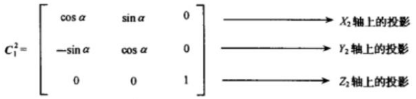
* 第1行表示旋转之后的**X2轴**在原坐标系(X1,Y1,Z1)轴下的投影
* 第2行表示旋转之后的**Y2轴**在原坐标系(X1,Y1,Z1)轴下的投影
* 第3行表示旋转之后的**Z2轴**在原坐标系(X1,Y1,Z1)轴下的投影

#### 5.2.2 东北天ENU---->右前上的余弦矩阵$C_{n}^{b}$推导
假设我们现在有一个东北天坐标系和一个载体坐标系，现需要将东北天坐标系经过3次旋转，使得最终得到的坐标系与载体坐标系重合。
> **在此之前，需要做出一些规定**
> * **旋转的正方向为：从旋转轴看的逆时针方向**
> * **旋转的顺序为：Z-X-Y**
> * **对应的欧拉角：Yaw-Pitch-Roll**

##### 1. 绕Z轴逆时针旋转$\psi$——Yaw

得到旋转矩阵$C_{n}^{1}$
$$
\quad
    C_{n}^{1}=
    \begin{bmatrix} \cos \psi & \sin \psi &0 \\ 
                    -\sin \psi & \cos \psi &0 \\
                    0 & 0 &1
    \end{bmatrix}
\quad
$$

##### 2. 绕X'轴逆时针旋转$\theta$——Pitch
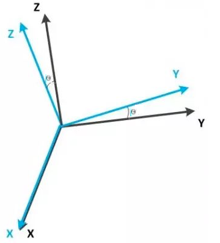
得到旋转矩阵$C_{1}^{2}$
$$
\quad
    C_{1}^{2}=
    \begin{bmatrix} 1 & 0 &0                      \\
                    0 &\cos \theta & \sin \theta  \\ 
                    0 &-\sin \theta & \cos \theta 
    \end{bmatrix}
\quad
$$

##### 3. 绕Y''轴逆时针旋转$\phi$——Roll
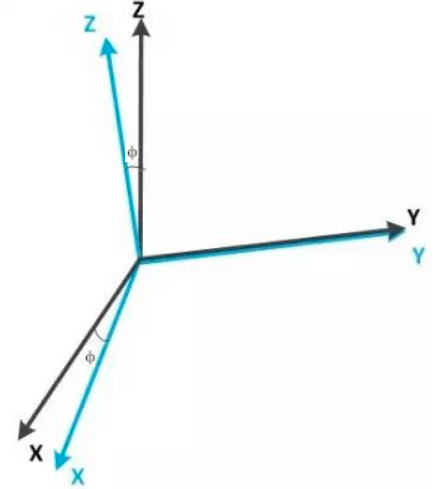
得到旋转矩阵$C_{2}^{3}$
$$
\quad
    C_{2}^{3}=
    \begin{bmatrix} \cos \phi & 0 &-\sin \phi   \\
                    0 & 1& 0                    \\ 
                    \sin \phi & 0& \cos \phi 
    \end{bmatrix}
\quad
$$

##### 4. 得到ENU导航坐标系到右前上载体坐标系的方向余弦矩阵$C_{n}^{b}$

$$
\begin{aligned}
    C_{n}^{b}=&C_{2}^{3}C_{1}^{2}C_{n}^{1} \\
    =&    
    \begin{bmatrix} \cos \phi & 0 &-\sin \phi   \\
                    0 & 1& 0                    \\ 
                    \sin \phi & 0& \cos \phi 
    \end{bmatrix}
    \begin{bmatrix} 1 & 0 &0                      \\
                    0 &\cos \theta & \sin \theta  \\ 
                    0 &-\sin \theta & \cos \theta 
    \end{bmatrix}
    \begin{bmatrix} \cos \psi & \sin \psi &0 \\ 
                    -\sin \psi & \cos \psi &0 \\
                    0 & 0 &1
    \end{bmatrix} \\
    =&
    \begin{bmatrix} 
        \cos \psi \cos \phi -\sin \psi \sin \theta \sin \phi
   & \sin \psi \cos \phi+\cos \psi \sin \theta \sin \phi & -\cos \theta \sin \phi \\
        -\sin \psi \cos \theta & \cos \psi \cos \theta & \sin \theta \\
        \cos \psi \sin \phi+ \sin \psi \sin \theta \cos \phi & \sin \psi \sin \phi- \cos \psi \sin \theta \cos \phi & \cos \theta \cos \phi
    \end{bmatrix}  \\
    = &
    \begin{bmatrix} c_{11} & c_{12} &c_{13} \\ 
                    c_{21} & c_{22} &c_{23} \\
                    c_{11} & c_{12} &c_{13}
    \end{bmatrix}
\end{aligned}
$$

#### 5.3 四元数
> 用欧拉角表示姿态需要指定顺序和方向，用余弦矩阵表示姿态则参数较多，四元数出现了。
> 四元数（Quaternions）是由爱尔兰数学家哈密顿（William Rowan Hamilton）在1843年提出。

三维空间的任意旋转，都可以用绕三维空间的某个轴旋转过某个角度来表示，即所谓的Axis-Angle表示方法。这种表示方法里，Axis可用一个三维向量(x,y,z)来表示，θ可以用一个角度值来表示，直观来讲，一个四维向量(θ,x,y,z)就可以表示出三维空间任意的旋转。注意，这里的三维向量(x,y,z)只是用来表示axis的方向朝向，因此更紧凑的表示方式是用一个单位向量来表示方向axis，而用该三维向量的长度来表示角度值θ。

> 简单来说，**四元数的思想就是把方向余弦矩阵的三次旋转表示为只绕一个旋转轴旋转一次完成**，因此可以用4个数来表示这个过程，其中包括旋转轴向量的长度(θ)和旋转轴单位向量(x,y,z)

##### 5.3.1 四元数的表示
$$
\begin{aligned}
    \begin{bmatrix} 
        q_0 \\
        q_1 \\
        q_2 \\
        q_3
    \end{bmatrix}
    =
    \begin{bmatrix} 
        \cos \frac{\theta}{2}       \\
        x*\sin \frac{\theta}{2}     \\
        y*\sin \frac{\theta}{2}     \\
        z*\sin \frac{\theta}{2}     \\
    \end{bmatrix}
\end{aligned}
$$

##### 5.3.2 四元数的复数定义
> q=q0+q1i+q2j+q3k=[s,v]
其中 q0,q1,q2,q3均为实数, s=q0,v=[q1,q2,q3]，i2=j2=k2=−1
对于 i,j,k 本身的几何意义可以理解为一种旋转，其中 i 代表 x 轴与 y 轴相交平面中 x 轴正向向 y 轴正向的旋转， j 旋转代表 z 轴与 x 轴相交平面中 z 轴正向向 x 轴正向的旋转，k 旋转代表 y 轴与 z 轴相交平面中 y 轴正向向 z 轴正向的旋转， −i,−j,−k 分别代表 i,j,k 的反向旋转。

##### 5.3.3 四元数的模
$$
\begin{aligned}
    |q|=\sqrt{q_{0}^{2}+q_{1}^{2}+q_{2}^{2}+q_{3}^{2}}
\end{aligned}
$$

##### 5.3.4 四元数的运算
* 主要运算
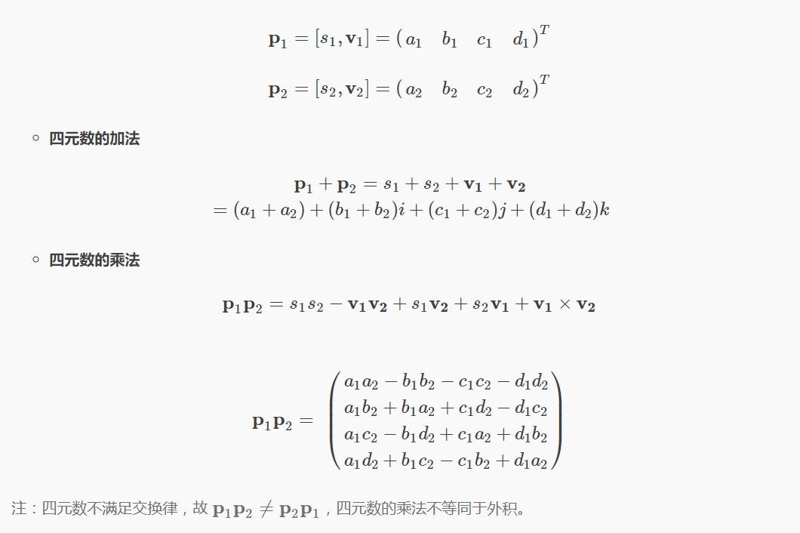
* 四元数乘法
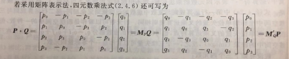、
> **乘法性质**
> 1. 满足结合律 
> 2. 不满足交换律 
> 3. 乘积的模等于模的乘积 
> 4. 乘积的逆等于各个四元数的逆以相反的顺序相乘
* 其他运算
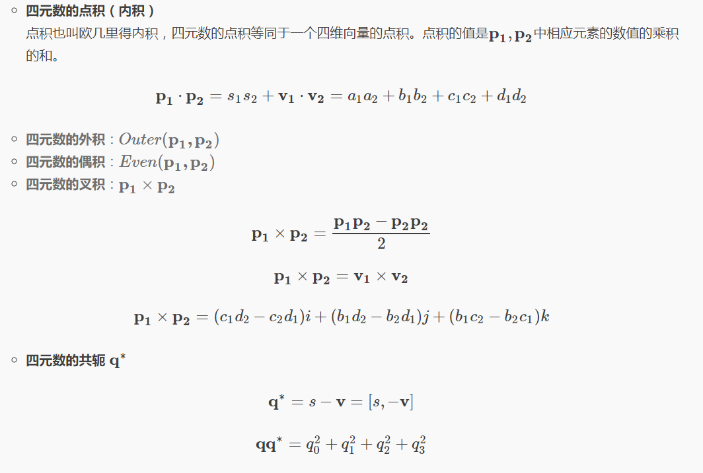


\*四元数部分参考：[旋转矩阵、欧拉角、四元数理论及其转换关系](https://blog.csdn.net/lql0716/article/details/72597719)

#### 5.4 ENU-右前上-312欧拉角、余弦矩阵、四元数相互转化

##### 5.4.1 转为欧拉角
* 方向余弦矩阵转欧拉角(假定已知方向余弦矩阵$C_{n}^{b}$)
$$
\begin{aligned}
    C_{n}^{b}=
    \begin{bmatrix} 
        \cos \psi \cos \phi -\sin \psi \sin \theta \sin \phi
   & \sin \psi \cos \phi+\cos \psi \sin \theta \sin \phi & -\cos \theta \sin \phi \\
        -\sin \psi \cos \theta & \cos \psi \cos \theta & \sin \theta \\
        \cos \psi \sin \phi+ \sin \psi \sin \theta \cos \phi & \sin \psi \sin \phi- \cos \psi \sin \theta \cos \phi & \cos \theta \cos \phi
    \end{bmatrix}
\end{aligned}
$$

$$
\begin{aligned}
    C_{b}^{n}=(C_{n}^{b})^{T} 
    \begin{bmatrix} c_{11} & c_{12} &c_{13} \\ 
                    c_{21} & c_{22} &c_{23} \\
                    c_{11} & c_{12} &c_{13}
    \end{bmatrix}
\end{aligned}
$$

$$
\begin{aligned}
    &pitch=\theta=\arcsin C_{32} \\
    \\
    &if |C_{32}| \leq 0.999999\\
    &\begin{cases} 
    roll=\phi=-atan2(C_{31},C_{33})\\
    pitch=\psi=-atan2(C_{12},C_{22}) 
    \end{cases} \\
    &else \\
    &\begin{cases}
    roll=\phi=atan2(C_{13},C_{11})\\
    pitch=\psi=0
    \end{cases}
\end{aligned}
$$

* 四元数转欧拉角
> 直接由四元数求欧拉角不容易，实际上，可通过余弦矩阵作为中间变量，进而求欧拉角。

$$
\begin{aligned}
    &pitch=\theta=\arcsin [2(q_{0}q_{1}+q_{2}q_{3})] \\
    \\
    &if |C_{32}| \leq 0.999999\\
    &\begin{cases} 
    roll=\phi=-atan2[2(q_{1}q_{3}-q_{0}q_{2}),q_{0}^{2}-q_{1}^{2}-q_{2}^{2}+q_{3}^{2}]\\
    pitch=\psi=-atan2[2(q_{1}q_{2}-q_{0}q_{3}),q_{0}^{2}-q_{1}^{2}+q_{2}^{2}-q_{3}^{2}]
    \end{cases} \\
    &else \\
    &\begin{cases}
    roll=\phi=atan2[2(q_{1}q_{3}+q_{0}q_{2}),q_{0}^{2}+q_{1}^{2}-q_{2}^{2}-q_{3}^{2}]\\
    pitch=\psi=0
    \end{cases}
\end{aligned}
$$

##### 5.4.2 转为余弦矩阵
* 312欧拉角到余弦矩阵
$$
\begin{aligned}
    C_{n}^{b}=
    \begin{bmatrix} 
        \cos \psi \cos \phi -\sin \psi \sin \theta \sin \phi
   & \sin \psi \cos \phi+\cos \psi \sin \theta \sin \phi & -\cos \theta \sin \phi \\
        -\sin \psi \cos \theta & \cos \psi \cos \theta & \sin \theta \\
        \cos \psi \sin \phi+ \sin \psi \sin \theta \cos \phi & \sin \psi \sin \phi- \cos \psi \sin \theta \cos \phi & \cos \theta \cos \phi
    \end{bmatrix}
\end{aligned}
$$

* 四元数到余弦矩阵
$$
\begin{aligned}
    &C_{b}^{n}=
    \begin{bmatrix} 
        q_{0}^{2}+q_{1}^{2}-q_{2}^{2}-q_{3}^{2} &
        2(q_{1}q_{2}-q_{0}q_{3}) &
        2(q_{1}q_{3}+q_{0}q_{2}) \\
        2(q_{1}q_{2}+q_{0}q_{3}) &
        q_{0}^{2}-q_{1}^{2}+q_{2}^{2}-q_{3}^{2} &
        2(q_{2}q_{3}-q_{0}q_{1}) \\
        2(q_{1}q_{3}-q_{0}q_{2}) &
        2(q_{2}q_{3}+q_{0}q_{1}) &
        q_{0}^{2}-q_{1}^{2}-q_{2}^{2}+q_{3}^{2}
    \end{bmatrix} \\
    &C_{n}^{b}=(C_{b}^{n})^{T}
\end{aligned}
$$

##### 5.4.3 转为四元数

* 312欧拉角到四元数

$$
\begin{aligned}
    \begin{bmatrix} 
        q_0 \\
        q_1 \\
        q_2 \\
        q_3
    \end{bmatrix}
    =
    \begin{bmatrix} 
        \cos \frac{\psi}{2} \cos \frac{\theta}{2} \cos \frac{\phi}{2}-  \sin \frac{\psi}{2} \sin \frac{\theta}{2} \sin \frac{\phi}{2}  \\
        \cos \frac{\psi}{2}  \sin \frac{\theta}{2}  \cos \frac{\phi}{2}- \sin \frac{\psi}{2} \cos \frac{\theta}{2}  \sin \frac{\phi}{2}\\
        \sin \frac{\psi}{2} \sin \frac{\theta}{2} \cos \frac{\phi}{2} + \cos \frac{\psi}{2} \cos \frac{\theta}{2}  \sin \frac{\phi}{2} \\
        \sin \frac{\psi}{2} \cos \frac{\theta}{2} \cos \frac{\phi}{2} +  \cos \frac{\psi}{2} \sin \frac{\theta}{2}  \sin \frac{\phi}{2}\\
    \end{bmatrix}
\end{aligned}
$$

* 方向余弦矩阵到四元数
    不常用
-----------------------------------------------------

### 6. 姿态解算

#### 6.1 传感器坐标系准备
> 在进行解算之前，需要完成十分重要的一步(但是很多资料都没展开描述)，将加速度计、陀螺仪、磁力计对其到右前上坐标系。原因是一些集成的imu中三者坐标系并不一致。

##### 6.1.1 加速度计
* 车头朝前
* 向前加速，y轴加速度输出为+
* 向右加速，x轴加速度输出为+
* 向上加速，z轴加速度输出为+

##### 6.1.2 陀螺仪
* 车头朝前
* 从Z+看向Z-(即从上往下看)，逆时针旋转，Z轴角速度输出为+
* 从X+看向X-(即从车右侧看)，逆时针旋转(车头上翘)，X轴角速度输出为+
* 从Y+看向Y-(即从车头看)，逆时针旋转，Y轴角速度输出为+

##### 6.1.3 磁力计
* 车头朝北，即Y轴指北
* 磁力计应该输出形如
$$ 
\begin{aligned}
    Mag_b=    
    \begin{bmatrix} 
        0   \\
        M_N \\
        M_D 
    \end{bmatrix}
\end{aligned}  
$$
其中，
$$ 
\begin{aligned}
    M_D <0 ，北半球 \\
    M_D >0 ，北半球
\end{aligned}
$$
* 将车头稍微向西偏
* 检查此时输出，正确的输出形如(主要看之前为0的那一项的变化)：
$$ 
\begin{aligned}
    Mag_b=    
    \begin{bmatrix} 
        >0   \\
        a*M_N \\
        b*M_D 
    \end{bmatrix}
\end{aligned}  
$$
* 如果反向了，则需要添加‘-’号

#### 6.2 初始姿态计算
> 在进行姿态解算前，需要确定初始的姿态，
> * 使用加速度计确定俯仰和翻滚，pitch 和  roll
> * 使用磁力计确定偏航角  yaw

#### 6.2.1 确定俯仰和翻滚

* 对载体坐标系下的加速度(加速度计的输出)进行归一化
$$
\begin{aligned}
    Acc=Norm(Acc)
\end{aligned}
$$
* 计算俯仰pitch
  由于我们是以右前上作为载体坐标系，Y轴为车头方向，与网上很多飞控采用的前右下坐标系不一样，因此pitch与y轴方向加速度相关
$$
\begin{aligned}
    pitch=atan2(acc_y,\sqrt{acc_x^{2}+acc_z^{2}})
\end{aligned}
$$
* 计算翻滚roll
$$
\begin{aligned}
    roll=-atan2(acc_x,acc_z)
\end{aligned}
$$

实现代码C++
```C++
Vector3d getPoseFrom_Acc(Vector3d _acc){
    Vector3d acc=_acc;
    acc.normalize();
    double norm=sqrt(acc[0]*acc[0]+acc[1]*acc[1]+acc[2]*acc[2]);
    Vector3d result;
    result<<0,atan2(acc[1],sqrt(acc[0]*acc[0]+acc[2]*acc[2])),-atan2(acc[0],acc[2]);
    return result;
}
```
#### 6.2.2 确定偏航角
> 确定偏航角需要使用磁力计，使用磁力计之前请先按照官方给定校正说明对磁力计进行校正(另外还需要时不时校正，这个东西太弱了))

我们使用ENU和右前上坐标系，因此，当载体坐标系b系与导航坐标系n系重合时，即车头朝北时，正常输出如下：
$$ 
\begin{aligned}
    Mag_b=Mag_n=
    \begin{bmatrix} 
        0   \\
        M_N \\
        M_D 
    \end{bmatrix}
\end{aligned}  
$$

两坐标系不重合时，磁力计输出如下：
$$ 
\begin{aligned}
    Mag_{b1}=
    \begin{bmatrix} 
        mag_x^{b}   \\
        mag_y^{b} \\
        mag_z^{b} 
    \end{bmatrix}
\end{aligned}  
$$

假定有从导航坐标系n系到载体坐标系b系的方向余弦矩阵Cnb，那么将此时磁力计输出变换到导航坐标系下，得到:
$$ 
\begin{aligned}
    Mag_{b1}=C_n^{b}Mag_n=C_n^{b}
    \begin{bmatrix} 
        0   \\
        M_N \\
        M_D 
    \end{bmatrix}=
    \begin{bmatrix} 
        mag_x^{b}   \\
        mag_y^{b} \\
        mag_z^{b} 
    \end{bmatrix}
    =&
    \begin{bmatrix} 
        M_N (\sin \psi \cos \phi + \cos \psi \sin \theta \sin \phi)-M_D \cos \theta \sin \phi  \\
        M_N \cos \psi \cos \theta  +M_D \sin \theta \\
        M_N (\sin \psi \sin \phi- \cos \psi \cos \phi \sin \theta)+M_D \cos \theta \cos \phi
    \end{bmatrix}
\end{aligned}  
$$
对上式进行变换:
$$
\begin{aligned}
    my=M_N\sin \psi=&mag_x^{b}\cos \phi+ mag_z^{b}\sin \phi \\
    mx=M_N\cos \psi=&mag_x^{b}\sin \phi \sin \theta+ mag_y^{b}\cos \theta -mag_z^{b}\cos \phi \sin \theta
\end{aligned}
$$
综上，可得偏航角Yaw
$$
\begin{aligned}
    Yaw=\psi=atan2(my,mx)
\end{aligned}
$$

#### 6.3 基于Mahony算法的姿态解算
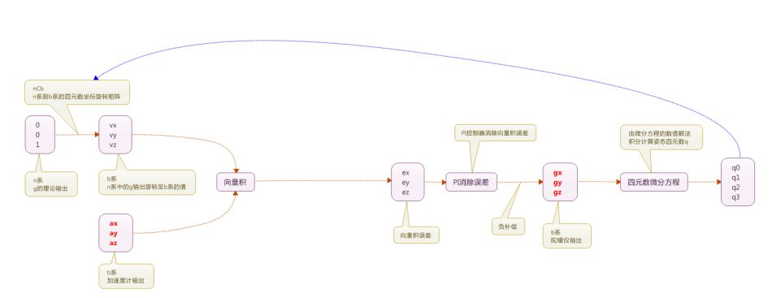

**数据准备**
* 取初始姿态Yaw,pitch,roll 
* 利用euler_312_To_quaternion()函数，得到初始姿态对应的四元数q
* 利用C_nb_312_from_qnb()函数，得到初始姿态对应的旋转矩阵Cnb

**利用磁力计校正Yaw偏差计算**
* 取当前b系下磁力计输出,并归一化
$$Mag=Norm(Mag)$$
* 将b系的磁力向量转换到n系下
$$
MagRef=(C_{n}^{b})^TMag
$$
* 构建基于b系磁力分量和姿态矩阵的理想磁力计输出
$$
\begin{aligned}
    MagRef\_= &
    \begin{bmatrix} 
        0          \\
        \sqrt{MagRef[0]^2+MagRef[1]^2} \\
        MagRef[2] 
    \end{bmatrix} \\
    MagDir\_hat=& \frac{1}{2}C_{n}^{b}MagRef\_
\end{aligned}
$$
* 利用叉乘计算实际与理想的偏差
$$
    Mag\_err=Mag \times MagDir\_hat
$$
* 设置磁力分量偏差的Kp和Ki值
* 计算磁力分量误差
$$
\begin{aligned}
    err_p=&kp_{yaw}*Mag\_err \\
    err_i=&ki_{yaw}*\Delta T*Mag\_err
\end{aligned}
$$

**利用加速度计校正pitch、roll偏差计算**
* 取当前b系下加速度计输出,并归一化
$$Acc=Norm(Acc)$$
* 由于标准n系下的加速度计输出应该只有重力分量，即归一化后的理想n系加速度为:
$$
\begin{aligned}
    Acc_n=
    \begin{bmatrix} 
        0   \\
        0   \\
        1 
    \end{bmatrix} \\
    Acc\_hat=C_{n}^{b}Acc_n
\end{aligned}
$$
* 利用叉乘计算实际与理想的偏差
$$
    Acc\_err=Acc \times Acc\_hat
$$
* 设置pitch\roll偏差的Kp和Ki值
* 计算pitch\roll偏差
$$
\begin{aligned}
    err_p=&err_p+kp_{rollpitch}*Acc\_err \\
    err_i=&err_i+ki_{rollpitch}*\Delta T*Acc\_err
\end{aligned}
$$

**对陀螺仪输出角速度进行偏差修正**
$$
\begin{aligned}
    w=gyro=
    \begin{bmatrix} 
        gyro_x   \\
        gyro_y   \\
        gyro_z 
    \end{bmatrix}
    +
    \begin{bmatrix} 
        err_p[0]   \\
        err_p[1]   \\
        err_p[2] 
    \end{bmatrix}
    +
    \begin{bmatrix} 
        err_i[0]   \\
        err_i[1]   \\
        err_i[2] 
    \end{bmatrix}
\end{aligned}
$$

**角速度积分，得到角度较小变化量w**
$$
    \Delta \theta=gyro*\Delta T
$$

**解四元数微分方程**
* 四元数微分方程如下：
$$
\begin{aligned}
    \dot{Q}(t)=\frac{1}{2}M'_{w(t)}Q(t)
\end{aligned}
$$

* 闭合解为：
$$
\begin{aligned}
    Q(t+1)=e^{\frac{1}{2}\Delta\Theta }Q(t)
\end{aligned}
$$
其中，
$$
\begin{aligned}
    \Delta\Theta=\int_{t_k}^{t_k+1}
    \begin{bmatrix} 
        0   &-w_x    &-w_y  &-w_z \\
        w_x &0  &w_z    &-w_{y} \\
        w_y &-w_z   &0  &w_x    \\
        w_z &w_y    &-w_x   &0 \\
    \end{bmatrix}
    dt
    \approx
        \begin{bmatrix} 
        0   &-\Delta\theta_x    &-\Delta\theta_y  &-\Delta\theta_z \\
        \Delta\theta_x &0  &\Delta\theta_z    &-\Delta\theta_{y} \\
        \Delta\theta_y &-\Delta\theta_z   &0  &\Delta\theta_x    \\
        \Delta\theta_z &\Delta\theta_y    &-\Delta\theta_x   &0 \\
    \end{bmatrix}
\end{aligned}
$$
* 为了减少运算量，通常采用近似解
* 毕卡近似解如下：
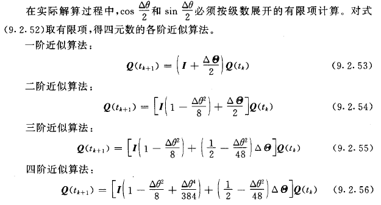
其中，
$$
    \Delta \theta^2=\Delta \theta_x^{2}+\Delta \theta_y^{2}+\Delta \theta_z^{2}
$$

**代码如下**
```C++
void mahony(double currT){
    //初始化
    static double deltaT_prev=0;
    static bool init=false;
    if(!init){
        deltaT_prev=currT;
        init=true;
        return ;
    }
    //**数据准备**
    Quaterniond q=curr_pose;//euler2quaternion(align_pose);
    Matrix3d Cnb=C_nb_312_from_qnb(q);
    Cnb.normalize();

    //**对陀螺仪输出角速度进行偏差修正**
    Vector3d mag=mag_dev.mag;
    mag.normalize();
    Vector3d magRef=Cnb.transpose()*mag;  //得到n系下的磁力计分量

    Vector3d magRef_(0,sqrt(magRef[0]*magRef[0]+magRef[1]*magRef[1]),magRef[2]);

    //估计磁场方向
    Vector3d magDir_hat=0.5*Cnb*magRef_;

    //mag 与 方向进行叉积
    Vector3d mag_cross_magDir=mag.cross(magDir_hat);

    //计算偏差
    Vector3d err_p(0,0,0);
    Vector3d err_i(0,0,0);

    double kp_yaw=1.2;
    double ki_yaw=0.0002;
    err_p=err_p+kp_yaw*mag_cross_magDir;
    err_i=err_i+ki_yaw*(currT-deltaT_prev)*mag_cross_magDir;

    //**利用加速度计校正pitch、roll偏差计算**
    Vector3d acc;
    acc=imu_dev.acc;
    acc.normalize();

    Vector3d vv=Cnb*Vector3d(0,0,1);
    Vector3d acc_cross_vv=acc.cross(vv);

    double kp_rollpitch=1.2;
    double ki_rollpitch=0.0002;
    err_p=err_p+kp_rollpitch*acc_cross_vv;
    err_i=err_i+ki_rollpitch*(currT-deltaT_prev)*acc_cross_vv;

    //**对陀螺仪输出角速度进行偏差修正**
    Vector3d gyro=imu_dev.gyro;

    gyro=gyro+err_p+err_i;

    //**角速度积分，得到角度较小变化**
    if((currT-deltaT_prev)>0){
        gyro=gyro*(currT-deltaT_prev);
    }
    else
        return;

    //**解四元数微分方程**
    Matrix4d gyro_mat;
    gyro_mat<<  0,    -gyro[0],   -gyro[1],   -gyro[2],
                gyro[0],    0,      gyro[2],    -gyro[1],
                gyro[1], -gyro[2],        0,    gyro[0],
                gyro[2],  gyro[1],  -gyro[0],   0;

    double gyro_L2=sqrt(gyro[0]*gyro[0]+gyro[1]*gyro[1]+gyro[2]*gyro[2]);

    //**毕卡解法**
    Vector4d q_curr;
    q_curr<<q.w(),q.x(),q.y(),q.z();
    Vector4d q_new=((1-gyro_L2*gyro_L2/8)*Matrix4d::Identity()+(0.5-gyro_L2*gyro_L2/48)*gyro_mat)*q_curr;

    Quaterniond output;
    output.w()=q_new[0];
    output.x()=q_new[1];
    output.y()=q_new[2];
    output.z()=q_new[3];
    output.normalize();
    curr_pose=output;
    deltaT_prev=currT;
}
```


#### 6.4 基于DCM余弦矩阵的姿态解算
> * 基于DMC的解法基本思路与Mahony解法相似，这里不赘述，有兴趣的同学可以参考Razor_AHRS的算法
> * 传送门：https://github.com/KristofRobot/razor_imu_9dof
> 


#### 6.5 基于扩展卡尔曼滤波的姿态解算
> 这里不展开卡尔曼、扩展卡尔曼的内容，只是把它当作工具使用

#### 概览
##### 1 状态变量、观测量说明
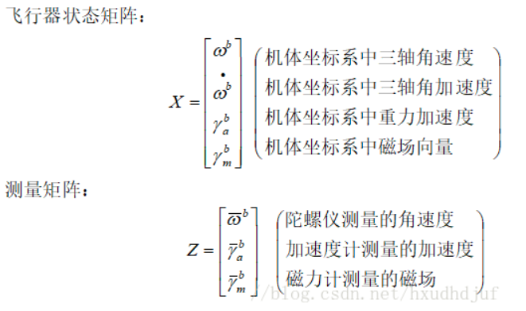

##### 2 状态转移
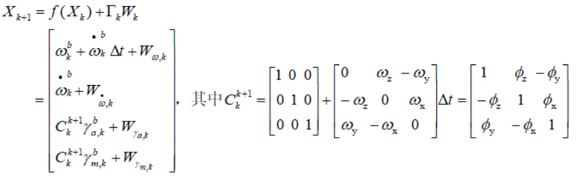

##### 3 观测矩阵
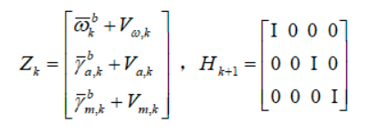

##### 4 卡尔曼方程组
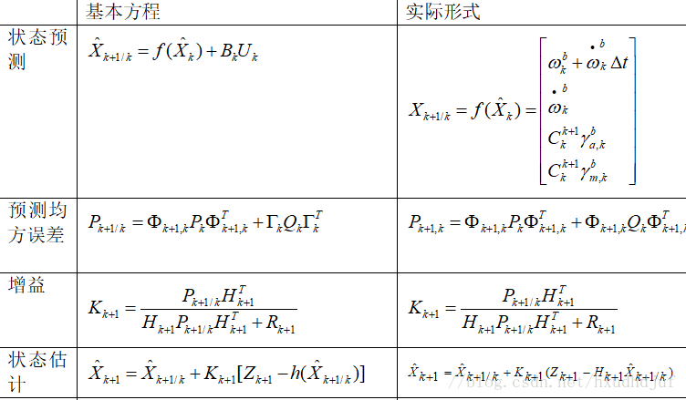

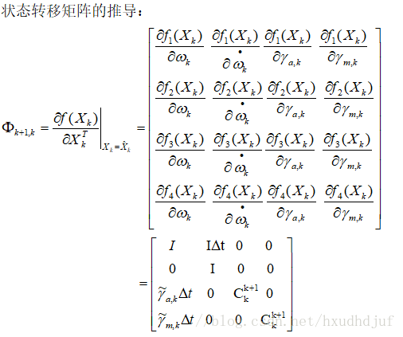
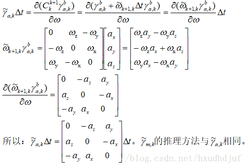

> 概览部分参考自：[四旋翼姿态解算--互补滤波和拓展卡尔曼](https://blog.csdn.net/hxudhdjuf/article/details/79594866)

--------------------------------------------------------

#### 具体步骤
##### 1 状态变量
$$
\begin{aligned}
    X_{12x1}=
    \begin{bmatrix} 
        \hat{gyro}_{3x1}   \\
        \hat{\dot{gyro}}_{3x1}   \\
        \hat{Acc}_{3x1}^{b}   \\
        \hat{Mag}_{3x1}^{b} 
    \end{bmatrix}
    \begin{bmatrix} 
        b系三轴角速度估计   \\
        角加速度估计   \\
        b系加速度估计   \\
        b系磁力分量估计
    \end{bmatrix}
\end{aligned}
$$

##### 2 观测量
$$
\begin{aligned}
    Z_{9x1}=
    \begin{bmatrix} 
        gyro_{3x1}   \\
        Acc_{3x1}^{b}   \\
        Mag_{3x1}^{b} 
    \end{bmatrix}
    \begin{bmatrix} 
        b系三轴角速度测量   \\
        b系加速度测量   \\
        b系磁力分量测量
    \end{bmatrix}
\end{aligned}
$$

##### 3 状态转移矩阵
* 非线性状态转移（预测）
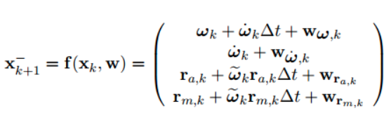
其中,
$
    r_{a,k}为k时刻下的加速度,r_{m,k}为k时刻下的磁力计输出,\tilde w_{k}为描述姿态发生变化的余弦矩阵,W项为高斯噪声
$

* EKF线性化
    对非线性函数在$\hat{x_{k}}$处求一阶导，得到雅克比矩阵为状态转移矩阵
$$
\begin{aligned}
    A_{lin,k}=\frac{\partial f(x_{k},w_{k})}{\partial x_{k}}=
    \begin{bmatrix} 
        I_{3x3} &I_{3x3}\Delta T & 0 & 0   \\
        0   &I_{3x3}    &0      &0        \\
        -r_{acc}\Delta T  &0  &I_{3x3}+r_{gyro}\Delta T &0 \\
        -r_{mag}\Delta T  &0  &0  &I_{3x3}+r_{gyro}\Delta T
    \end{bmatrix}
\end{aligned}
$$
其中,
$r_{acc}$为加速度的反对称矩阵
$r_{mag}$为磁力分量的反对称矩阵
$r_{gyro}$为角速度的反对称矩阵

* 计算协方差矩阵估计
$$
\begin{aligned}
    \hat{P}=A_{lin,k}PA_{lin,k}^{T}+Q
\end{aligned}
$$

##### 4 更新
* 观测矩阵
$$
\begin{aligned}
    H=
    \begin{bmatrix} 
        I_{3x3} & 0 &0 &0 \\
        0 &0 &I_{3x3}  &0\\
        0 &0 &0 &I_{3x3}
    \end{bmatrix}
\end{aligned}
$$
* 观测
$$
\begin{aligned}
    Y=Z-H\hat{X}
\end{aligned}
$$
* 计算卡尔曼增益
$$
    K=\hat{P}H^{T}(H\hat{P}H^{T}+R_{k})^{-1}
$$
* 更新状态变量估计
$$
    X=\hat{X}+KY
$$
* 更新协方差矩阵
$$
    P=(I-KH)\hat{P}
$$

> 代码：待更新

----------------------------------------------------------